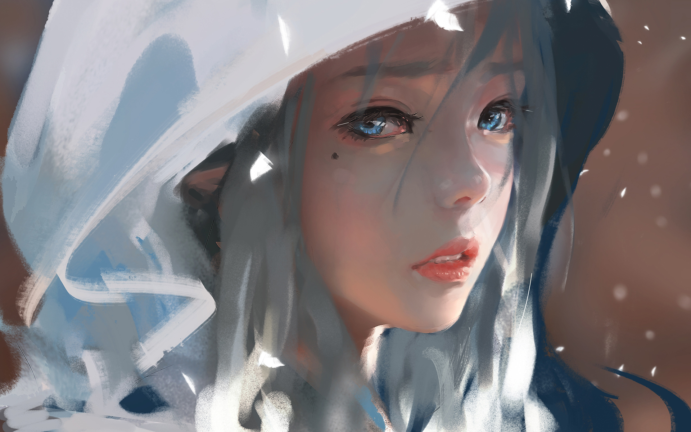

## 目标： 能够使用精灵图，能够给元素添加 阴影效果，能够让元素完成过渡效果
#### 学习路径：
+ + 精灵图
+ + 背景图片大小
+ + 文字阴影
+ + 盒子阴影
+ + 过渡

### 精灵图的介绍
##### 项目中将多张小图片，合并成为一张大图片，这张大图片称之为精灵图
+ + 优点，减少服务器发送次数，减轻服务器压力，提高网页加载速度
+ + 把多张小图合成一张大图发送给服务器
### 精灵图的使用方法
+ + 创建一个盒子，设置盒子的尺寸和小图尺寸相同
+ +  将精灵图设置为盒子的背景图片
+ + 修改背景图片的位置
+ +  + 通过测量工具测量小图片左上角坐标，分别取负值设置给盒子的 background-position:x y ; 
- - background-position:x y ; 背景图位置属性：改变背景图的位置，两个属性：水平方向的位置，垂直方向的位置；两个值都取负值。

        <style>
        span {
            display: inline-block;
            /*background-position 改变背景图的位置，两个属性：水平方向的位置，垂直方向的位置； */
            background-position:-3px 0 ;
            width: 18px;
            height: 24px;
            background-color: pink;
            background-image:url(./images/taobao.png);
            
        }
        a{
            display: inline-block;
            background-position: -0px -90px;
            margin-left:20px ;
            width: 24px;
            height: 24px;
            background-image: url(./images/taobao.png);
        }
        </style>
        </head>
        <body>
        <!-- img会让图片整个显示出来 -->
        <!--  -->
        <!-- 一般精灵图的标签，都用行内标签（span  b  i ...）-->
        <span></span>
        <a href="#"></a>
        </body>


### 背景图片大小
#### 设置背景图片的大小
##### 连写 background：color image repeat position/size； 实例：background: pink url(相对路径) no-repeat center/cover;
+ 语法：background-size: 宽度 高度 ;

|取值|场景|
|:---:|:---:|
|数字+px|简单方便，常用|
|百分比|相当于当前盒子自身的宽高百分比|
|contain|包含，将背景图片等比例缩放，直到不会超出盒子的最大|
|cover|覆盖，将背景图片等比例缩放，直到刚好填满整个盒子没有空白|

        <style>
        .box{
            width: 500px;
            height: 500px;
            background-color: aquamarine;
            background-image: url(./images/5cb972785fa64.jpg);
            /* 设置不平铺 */
            background-repeat: no-repeat;
            /* 设置背景图片的大小 */
            /* 如果图的宽或者高与盒子的尺寸相同了，那么另外一个方向会停止缩放 ，会导致盒子可能有留白*/
            background-size:contain;
             /* 工作中，图的比例和盒子的比例都是相同的，可以使用contain或者cover 效果完全相同*/
             
             background: url(./images/5cb972785fa64.jpg ) no-repeat center/cover;
            /* 连写属性 */
        }
    </style>
    </head>
    <body>
    <div class="box"></div>
    </body>


## 盒子阴影
#### 给盒子添加阴影效果，吸引用户注意，体现页面的制作细节
+ + 属性名：box-shadow

|取值|场景|
|:---:|:---:|
|h-shadow|必需的。水平阴影偏移量，允许负值|
|v-shadow|必需的。垂直阴影偏移量。允许负值|
|blur|可选。模糊距离|
|spread|可选。阴影扩大|
|color|可选。阴影的颜色|
|inset|可选。外层的阴影改变为内侧阴影|

        <style>
        .box{
            width: 200px;
            height: 200px;
            background-color: #ccc;
            margin: 50px auto;
            /*内阴影  */
            box-shadow:0px 0px 5px 10px red inset;            
        }
        /* 如果是外阴影，inset可以不用写 */
        .box1{
            width: 200px;
            height: 200px;
            background-color: #ccc;
            margin: 50px auto;
            /*外阴影  */
            box-shadow:10px 10px 5px  red ;            
        }
    </style>
    </head>
    <body>
    <div class="box"></div>
    <div class="box1"></div>
    </body>


## 过渡 
### 让元素的样式慢慢的变化，配合hover使用，增强网页交互体验
+ 属性名：transition
+ 取值：过渡的属性：：all 所有能过渡的属性都能过渡，具体属性名如:width 只有width有过渡
+ 过渡的时长  数字+s(秒，可以取小数点)
+ + 注意： 过渡需要：默认状态和:hover 样式状态不同，才有过渡效果
+ + transition属性给需要过渡的元素本身添加
+ + transition属性设置在不同状态中，效果不同
+ + + 1. 给默认状态设置，鼠标移入移出都有过渡效果
+ + + 2. 给hover状态设置，鼠标移入有过渡效果，移出没有过渡效果

```
    <style>
        .w{
            width: 500px;
            height: 400px;
        }
       
        .box{
            box-sizing: border-box;  
            overflow: hidden;
        }
        /* 鼠标移入让图片变大 */
        .box .w:hover{
            transform: scale(1.3);
        }
         /* 谁变化给谁添加transition属性 */
       .box .w{
        width: 100%;
        height: 100%;
        transition: 1.5s;
       }  
    </style>
</head>
<body>
    <div class="box w">
        
    </div>
</body>
```    

